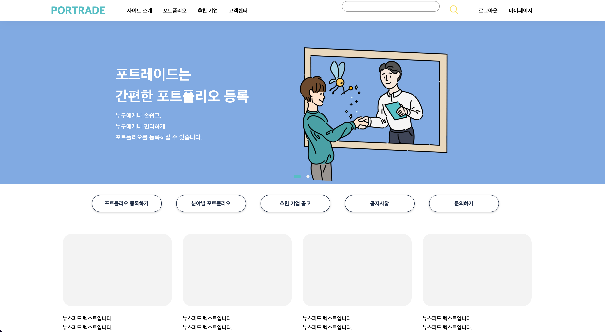

# Portrade FrontEnd

### Portrade
Portfolio와 Trade의 합성어로 다양한 분야의 포트폴리오를 업로드 할 수 있는 공간입니다.

## 개발 인원 및 기간

- **개발 기간** : 2021.09.12 ~ 진행중
- **개발 인원** : 5인 (프론트엔드 3인, 백엔드 2인)
- **개발자** : 
    -   프론트엔드 : 민준경, 임지우, 하현준
    -   백엔드 : 김진성, 김나연

## 기술스택
### FrontEnd
-   React.js
-   Redux
-   Axios
-   Material-UI

## 협업도구

-   Git & Github
-   [Notion](https://www.notion.so/608a27b21f8d4ccf883550b1bd7db4ba)

## 핵심 기능

-   사용자 관리
    -   회원가입 및 로그인, 로그아웃
    -   sessionStorage 를 사용해 유저별 token 발급 및 로그인 유지
-   기업 및 공고 등록
    -   기업 등록 후 기업별 공고 등록, 조회수 및 마이페이지에 저장
-   CRUD
    -   1:1문의, 공지, 자주 묻는 질문 CRUD 구현
-   carousel & modal
    -   기업 공고 carousel과 , 공고 상세 modal 간 라우팅 연결
-   포트폴리오 관리
    - 파일 등록 및 열람

## 담당 업무

  <h4> Front-End </h4>
  <table style="text-align:center;">
    <tr>
      <th><a href="https://github.com/junbox98221">민준경</a></th>
      <th><a href="https://github.com/tmdckszm">임지우</a></th>
    </tr>
    <tr>
      <td>
        - 문의, 공지, 자주 묻는 질문 CRUD 구현 
        - React-Modal 구현 
        - 페이지, Carousel, Modal component 간 라우팅 연결
      </td>
      <td>
        - 회원가입, 로그인, 로그아웃 구현 
        - 포트폴리오 열람 modal 구현 
        - 포트폴리오 등록창 구현
      </td>
    </tr>
  </table>

## Preview

-   프로젝트 완성 후 이미지 추가 예정

